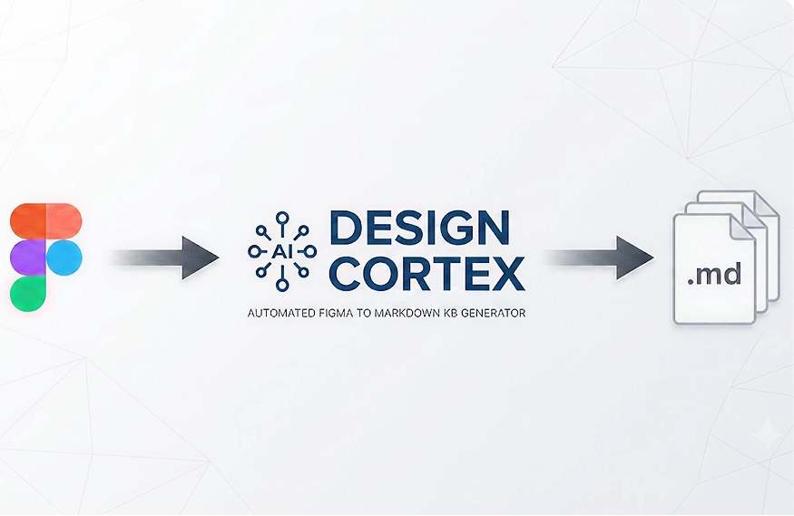

<p align="center">
  
</p>

# Design System KB Generator

Point an AI agent at your Figma design system, run it once, and get a structured, two-tier markdown **knowledge base** of your entire system: every component, variant, token, and composition rule. Any agent (Cursor, Claude Code, …) can read it at session start instead of querying Figma live.

**No API keys. No Python. No infrastructure.** Just an agent, a Figma MCP connection, and a folder of markdown.

---

## Requirements

- An **AI coding agent** that supports skills / long-form instructions and tool calls (e.g. Claude Code, or any agent you can point at the `SKILL.md` protocols).
- A **Figma MCP** connection to the file you want to extract: official remote, Figma desktop, Figma Console, or a custom MCP (see `SETUP.md`).
- **View access** to the Figma design-system file. The generator is strictly **read-only** against Figma; it never modifies your file.

No accounts, keys, or servers beyond your existing agent + MCP.

---

## Scale

Extraction runs as **batched, parallel subagents** writing a **sharded cache**, so nothing heavy sits in a single context window. It has been run end-to-end against a large production design system (~530 components / 133 sets / ~5,000 variants / 1,439 tokens). Very large flat icon sets collapse into a single manifest, and huge variant matrices can be sampled, so the KB (and every consuming agent's first load) stays small regardless of system size.

---

## Why

Agents querying Figma at task time is slow, expensive, and fragile. This generator does a one-time extraction into a portable KB. Agents then load `index.json`, navigate to the one component or token file they need, and work from that, never opening Figma during the task.

**The KB is the interface between your design system and the agent.**

---

## How it works

Four skills, run in order:

| Skill | Trigger | Does |
|---|---|---|
| `ds-extract` | "build my KB" | Crawls Figma via batched subagents, writes a sharded `kb-output/.cache/` (per-component shards + tokens + icons manifest) + a gap report |
| `ds-write` | runs after extract | Fans out subagents to turn the cache shards into the full `kb-output/` folder of markdown |
| `ds-refresh` | "refresh my KB" | Re-extracts, diffs by component key, updates — never touches your manual edits |
| `ds-validate` | "validate my KB" | Checks completeness, broken references, freshness |

The generator is **MCP-agnostic**: it calls Figma tools by logical function and adapts to whichever MCP you have (official remote, desktop, Figma Console, or custom). See `skills/ds-extract/references/mcp-tool-map.md`.

---

## Output shape (two-tier)

```
kb-output/
  index.json                         ← table of contents; agents load this first
  tokens/      color, typography, spacing, elevation, radius, motion
  patterns/    composition / layout / accessibility (+ your manual rules)
  components/
    atoms/ molecules/ organisms/
      Button/
        index.md                     ← Tier 1: everything to understand the component
        variants/hierarchy.md        ← Tier 2: loaded only when needed
  _review/                           ← components needing human classification
```

An agent loads `index.json` → a component's `index.md` → only the variant slice it needs. Token cost stays flat even for components with 80–100 variants.

---

## Install

**Via npm (recommended).** Installs the skills into your project's `.claude/` and scaffolds the config:

```bash
npx design-cortex init          # in your project root
```

This drops the four skills into `.claude/skills/`, the schemas/references into `.claude/shared/`, and a `.ds-kb-config.json` template at the root. Nothing to build, no dependencies.

**Or clone** and copy the `skills/` + `shared/` folders yourself; see `SETUP.md`.

---

## Quickstart

1. `npx design-cortex init` (or fill in `.ds-kb-config.json` from the example), then set `figma_mcp` and `figma_file_url`.
2. Connect your Figma MCP to the file.
3. Run `ds-extract` (e.g. say "build my design system KB").
4. `ds-write` runs automatically and produces `kb-output/`.
5. Run `ds-validate` to confirm completeness.
6. After Figma changes, run `ds-refresh`.

Full setup, MCP options, and manual skill installation: **`SETUP.md`**.

---

## What this is not

Not a governance tool. Not a vector DB or semantic search. Not a Figma plugin (runs via your agent, not inside Figma). Not opinionated about which agent, IDE, or MCP you use. The KB is a **derived artifact**; Figma stays the source of truth.

---

## Roadmap & contributing

The improvement backlog lives in [`TASKS.md`](TASKS.md) (prioritized P0–P2, traced to the issues found in real-world stress testing). Issues and PRs welcome.

## License

[MIT](LICENSE) © nico-scheinkman
